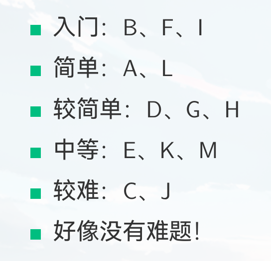
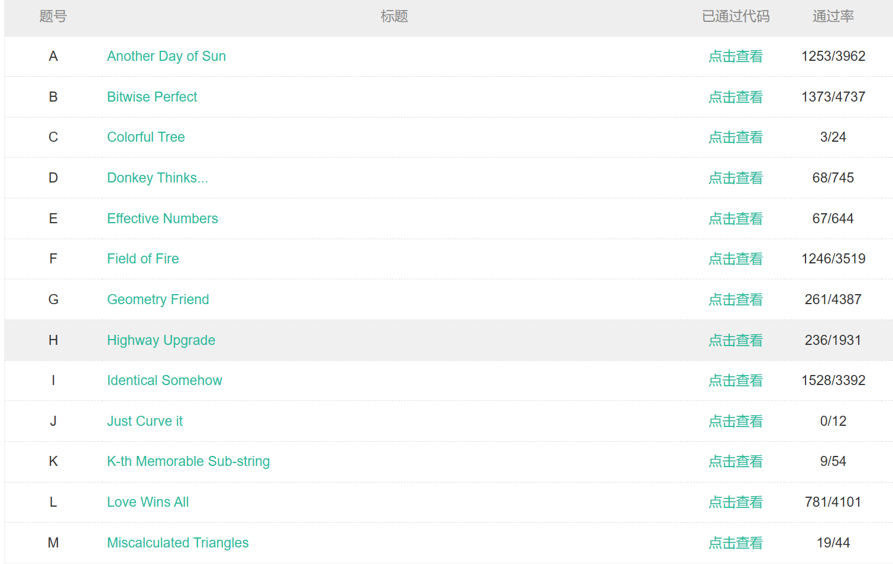

# 2025牛客暑期多校第二场

## 讲题录播:[2025牛客多校第二场出题人讲题录播_哔哩哔哩_bilibili](https://www.bilibili.com/video/BV1fDguzvEPJ/)

## 新手向讲题:[【新手向讲题】2025牛客多校第二场_哔哩哔哩_bilibili](https://www.bilibili.com/video/BV18rg7zyEbH/)

## [【验题报告】2025牛客暑期多校训练营2：AI 验题报告_ACM竞赛_ACM/CSP/ICPC/CCPC/比赛经验/题解/资讯_牛客竞赛OJ_牛客网](https://ac.nowcoder.com/discuss/1521470)

### 比赛地址:https://ac.nowcoder.com/acm/contest/108299

## [题目pdf](./1.pdf)

## [题解pdf](./2.pdf)

## [标答](./233) 

### 比赛情况:

#### 赛后分析: 分析不到位,消耗时间过多

### 官方难度分级:

### 过题人数:

##### 7/30 K题:

###### 有向图,n个点,m条边,有边权,还有一个边的参数t

###### q个询问,给定k,求1-n的最小边权,可以使用k次操作让边的边权减去参数t(不保留)

###### 正反图dji,

###### k次肯定都用在一条边上,最后可以简化为多条直线,求给定k,求在x=k处最小的y

